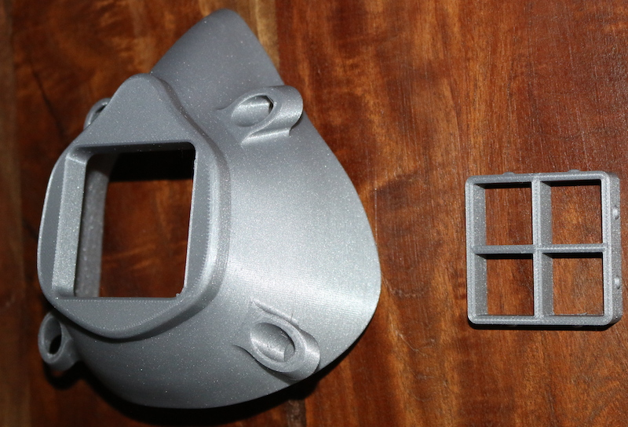

# 3dprinted-mask
A workflow to produce a 3D printed respirator mask

## Disclaimer
We do not know if this mask will protect you from either inhaling a contagious virus, or releasing one into the air yourself, upon exhaling, coughing or sneezing.

### Part I
To begin, download two files, the mask, and the filter holder. Print them both on a 3D printer. If you don’t have a 3D printer, or have thought about buying one, now is a great time.  We’d recommend [this one](https://shop.prusa3d.com/en/3d-printers/181-original-prusa-i3-mk3-3d-printer.html#) or [this one](https://shop.prusa3d.com/en/3d-printers/994-original-prusa-mini.html#).  

For printing, PLA material is fine with 10% infill. If the mask is sliced with the front square (“air in”) side down, no supports will be needed.  Combine the filter holder and mask in the same print job (arrange them on the build plate in the slicer software). It’ll take about 7 hours to complete. The default size is large. Scale down (in your slicer) to 90% for medium and 80% for small. Here’s what you’ll get.

